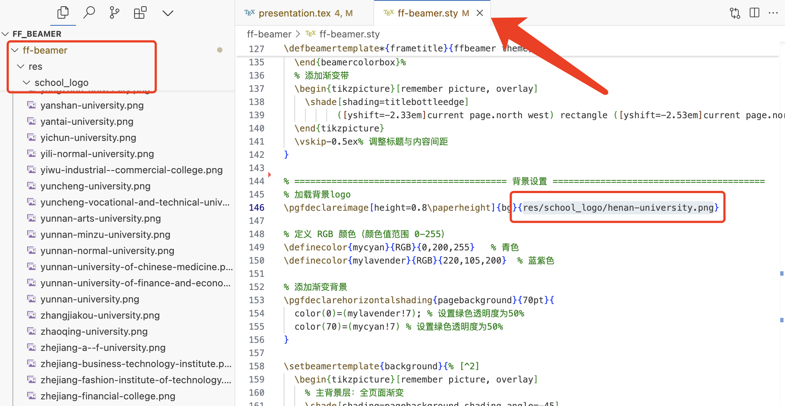
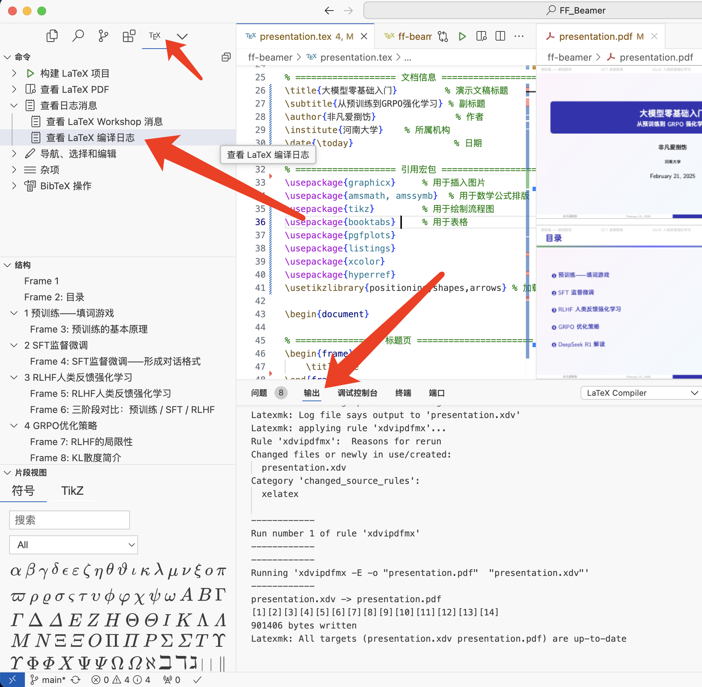
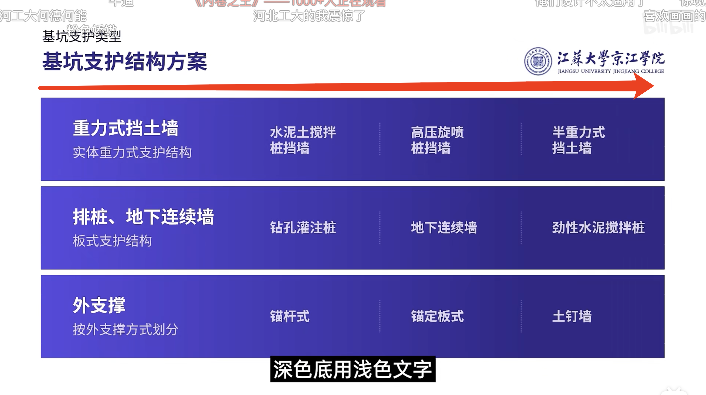

# FF_Beamer

## 使用说明

需要安装 TeX Live（Mac安装Mac LaTex）

在VSC中（或者Cursor中）安装 LaTex Workshop 插件

（VSC的AI插件推荐通义灵码，也可直接使用Cursor IDE，直接让AI改LaTex）

看这个教程设置中文编译器：https://blog.csdn.net/Haulyn5/article/details/124128533

个人喜欢 OPPO Sans 字体，可以搜一下，下载并安装。不喜欢的话在`.tex`最前面更换字体

## 排版PPT

- Beamer的语法看一看就会，不会的话AI会。

- 更换校徽，替换文件路径。

- 仓库根目录有用户手册，可以用NotebookLM等快速检索，获得用法。

- 为了避免报错，可以给AI说“使用简单的Beamer语法”。

- 如果有报错，可以查看报错喂给AI：

  

## 更新计划

- 自定义box
- 自定义页脚

## 待办

加粗用红色显示

背景图片回调

